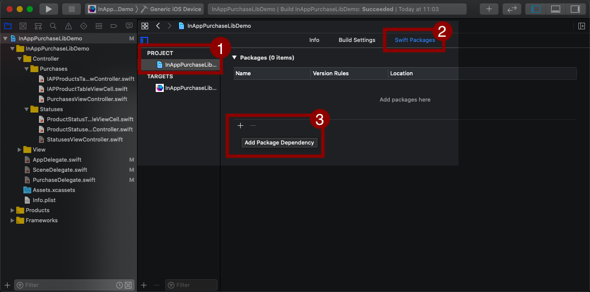

<p align="center">
  
</p>

> An easy-to-use library for In-App Purchases, using Fovea.Billing for receipts validation.

- [Features](#features)
- [Getting Started](#getting-started)
  - [Requirements](#requirements)
  - [Installation](#installation)
- [Usage](#usage)
  - [Initialization](#initialization)
  - [Displaying products](#displaying-products)
  - [Displaying subscriptions](#displaying-subscriptions)
  - [Refreshing](#refreshing)
  - [Purchasing](#purchasing)
    - [Making a purchase](#making-a-purchase)
    - [Processing purchases](#processing-purchases)
  - [Restoring purchases](#restoring-purchases)
  - [Purchased products](#purchased-products)
  - [Purchases information](#purchases-information)
  - [Errors](#errors)
- [Server integration](#server-integration)
- [Xcode Demo Project](#xcode-demo-project)
- [References](#references)
- [Troubleshooting](#troubleshooting)
- [License](#license)


# Features

* ✅ Purchase a product 
* ✅ Restore purchased products
* ✅ Verify transactions with the App Store on Fovea.Billing server
* ✅ Handle and notify payment transaction states
* ✅ Retreive products information from the App Store
* ✅ Support all product types (consumable, non-consumable, auto-renewable subscription, non-renewing subscription)
* ✅ Status of purchases available when offline
* ✅ Server integration with a Webhook

# Getting Started
If you haven't already, I highly recommend your read the *Overview* and *Preparing* section of Apple's [In-App Purchase official documentation](https://developer.apple.com/in-app-purchase)

## Requirements
* Configure your App and Xcode to support In-App Purchases.
  * [AppStore Connect Setup](https://help.apple.com/app-store-connect/#/devb57be10e7)
* Create and configure your [Fovea.Billing](https://billing.fovea.cc/?ref=iap-swift-lib) project account:
  * Set your bundle ID
  * The iOS Shared Secret (or shared key) is to be retrieved from [AppStoreConnect](https://appstoreconnect.apple.com/)
  * The iOS Subscription Status URL (only if you want subscriptions)

## Installation
<p align="center">
  
</p>

* Select your project in Xcode
* Go to the section *Swift Package*
* Click on *(+) Add Package Dependency*
* Copy the Git URL: *https://github.com/iridescent-dev/iap-swift-lib.git*
* Click on *Next* > *Next*
* Make sure your project is selected in *Add to target*
* Click on *Finish*

*Note:* You have to `import InAppPurchaseLib` wherever you use the library.


# Usage

The process of implementing in-app purchases involves several steps:
1. Displaying the list of purchasable products
2. Initiating a purchase
3. Delivering and finalizing a purchase
4. Checking the current ownership of non-consumables and subscriptions
5. Implementing the Restore Purchases button

## Initialization
Before everything else the library must be initialized. This has to happen as soon as possible. A good way is to call the `InAppPurchase.initialize()` method when the application did finish launching. In the background, this will load your products and refresh the status of purchases and subscriptions.

`InAppPurchase.initialize()` accepts the following arguments:
* `iapProducts` - An array of **IAPProduct** (REQUIRED)
* `validatorUrlString` - The validator url retrieved from [Fovea](https://billing.fovea.cc/?ref=iap-swift-lib) (REQUIRED)
* `applicationUsername` - The user name, if your app implements user login (optional)

Each **IAPProduct** contains the following fields:
* `productIdentifier` - The product unique identifier 
* `productType` - The **IAPProductType** (`consumable`, `nonConsumable`, `nonRenewingSubscription` or `autoRenewableSubscription`)

*Example:*

A good place is generally in your application delegate's `didFinishLaunchingWithOptions` function, like below:

``` swift
import InAppPurchaseLib

class AppDelegate: UIResponder, UIApplicationDelegate, IAPPurchaseDelegate {
  ...
  func application(_ application: UIApplication, didFinishLaunchingWithOptions launchOptions: [UIApplication.LaunchOptionsKey: Any]?) -> Bool {
    InAppPurchase.initialize(
      iapProducts: [
        IAPProduct(productIdentifier: "monthly_plan", productType: .autoRenewableSubscription),
        IAPProduct(productIdentifier: "yearly_plan",  productType: .autoRenewableSubscription),
        IAPProduct(productIdentifier: "disable_ads",  productType: .nonConsumable)
      ],
      validatorUrlString: "https://validator.fovea.cc/v1/validate?appName=demo&apiKey=12345678")
  }

  func productPurchased(productIdentifier: String) {
    // ... process purchase (we'll see that later)
  }
}
```

You should also call the `stop` method when the application will terminate, for proper cleanup.
``` swift
  func applicationWillTerminate(_ application: UIApplication) {
    InAppPurchase.stop()
  }
```

For more advanced use cases, in particular when you have implemented user login, you'll have to make some adjustments. We'll learn more about this in the [Server integration](#server-integration) section.

*Tip:* If initialization was successful, you should see a new receipt validation event in [Fovea's Dashboard](https://billing-dashboard.fovea.cc/events).

## Displaying products
Let's start with the simplest case: you have a single product.

You can retrieve all information about this product using the function `InAppPurchase.getProductBy(identifier: "my_product_id")`. This returns an [SKProduct](https://developer.apple.com/documentation/storekit/skproduct) extended with helpful methods.

Those are the most important:
 - `productIdentifier: String` - The string that identifies the product to the Apple AppStore.
 - `localizedTitle: String` - The name of the product, in the language of the device, as retrieved from the AppStore.
 - `localizedDescription: String` - A description of the product, in the language of the device, as retrieved from the AppStore.
 - `localizedPrice: String` - The cost of the product in the local currency (_read-only property added by this library_).

*Example*:

You can add a function similar to this to your view.

``` swift
@objc func refreshView() {
  guard let product: SKProduct = InAppPurchase.getProductBy(identifier: "my_product_id") else {
    self.titleLabel.text = "Product unavailable"
    return
  }
  self.titleLabel.text = product.localizedTitle
  self.descriptionLabel.text = product.localizedDescription
  self.priceLabel.text = product.localizedPrice
}
```

This example assumes `self.titleLabel` is a UILabel, etc.

Make sure to call this function when the view appears on screen, for instance by calling it from [`viewWillAppear`](https://developer.apple.com/documentation/uikit/uiviewcontroller/1621510-viewwillappear).

``` swift
override func viewWillAppear(_ animated: Bool) {
  self.refreshView()
}
```

## Displaying subscriptions
For subscription products, you also have some data about subscription periods and introductory offers.

 - `func hasIntroductoryPriceEligible() -> Bool` - The product has an introductory price the user is eligible to.
 - `localizedSubscriptionPeriod: String?` - The period of the subscription.
 - `localizedIntroductoryPrice: String?` -  The cost of the introductory offer if available in the local currency.
 - `localizedIntroductoryPeriod: String?` - The subscription period of the introductory offer.
 - `localizedIntroductoryDuration: String?` - The duration of the introductory offer.

**Example**

``` swift
@objc func refreshView() {
  guard let product: SKProduct = InAppPurchase.getProductBy(identifier: "my_product_id") else {
    self.titleLabel.text = "Product unavailable"
    return
  }
  self.titleLabel.text = product.localizedTitle
  self.descriptionLabel.text = product.localizedDescription

  // Format price text. Example: "0,99€ / month for 3 months (then 3,99 € / month)"
  var priceText = "\(product.localizedPrice) / \(product.localizedSubscriptionPeriod!)"
  if product.hasIntroductoryPriceEligible() {
      if product.introductoryPrice!.numberOfPeriods == 1 {
          priceText = "\(product.localizedIntroductoryPrice!) for \(product.localizedIntroductoryDuration!)" +
          " (then \(priceText))"
      } else {
          priceText = "\(product.localizedIntroductoryPrice!) / \(product.localizedIntroductoryPeriod!)" +
          " for \(product.localizedIntroductoryDuration!) (then \(priceText))"
      }
  }
  self.priceLabel.text = priceText
}
```

*Note:* You have to `import StoreKit` wherever you use `SKProduct`.

## Refreshing
Data might change or not be yet available when your "product" view is presented. In order to properly handle those cases, you should refresh your view after refreshing in-app products metadata. You want to be sure you're displaying up-to-date information.

To achieve this, call `InAppPurchase.refresh()` when your view is presented.

``` swift
override func viewWillAppear(_ animated: Bool) {
  self.refreshView()
  InAppPurchase.refresh(callback: { _ in
      self.refreshView()
  })
}
```

## Purchasing
The purchase process is generally a little bit more involving than most people would expect. Why is it not just: purchase &rarr; on success unlock the feature?

Several reasons:
- In-app purchases can be initiated outside the app
- In-app purchases can be deferred, pending parental approval
- Apple wants to be sure you delivered the product before charging the user

That is why the process looks like so:
- being ready to handle purchase events from app startup
- finalizing transactions when product delivery is complete
- sending purchase request, for which successful doesn't always mean complete

### Initiating a purchase
To initiate a purchase, use the `InAppPurchase.purchase()` function. It takes the `productIdentifier` and a `callback` function, called when the purchase has been processed.

**Important**: Do not process the purchase here, we'll handle that later!

From this callback, you can for example unlock the UI by hiding your loading indicator and display a message to the user.

*Example:*

``` swift
self.loaderView.show()
InAppPurchase.purchase(
  productIdentifier: "my_product_id",
  callback: { _ in
    self.loaderView.hide()
})
```

This simple example locks the UI with a loader when the purchase is in progress. We'll see later how the purchase has to be processed by your applicaiton.

The callback also gives more information about the outcome of the purchase, you might want to use it to update your UI as well. Note that some events are useful for analytics. So here's a more complete example.

``` swift
self.loaderView.show()
InAppPurchase.purchase(
  productIdentifier: "my_product_id",
  callback: { result in
    self.loaderView.hide()

    switch result.state {
    case .purchased:
      // Product successfully purchased
      // Reminder: Do not process the purchase here, only update your UI.
      //           that's why we do not send data to analytics.
      openThankYouScreen()
    case .failed:
      // Purchase failed
      // - Human formated reason can be found in result.localizedDescription
      // - More details in either result.skError or result.iapError
      showError(result.localizedDescription)
    case .deferred:
      // The purchase is deferred, waiting for the parent's approval
      openWaitingParentApprovalScreen()
    case .cancelled:
      // The user canceled the request, generally only useful for analytics.
  }
})
```

If the purchase fails, result will contain either `.skError`, a [`SKError`](https://developer.apple.com/documentation/storekit/skerror/code) from StoreKit, or `.iapError`, an [`IAPError`](#errors).

*Tip:* After a successful purchase, you should see a new transaction in [Fovea's dashboard](https://billing-dashboard.fovea.cc/transactions).

## Handling purchases
Finally, the magic happened: a user purchased one of your products! Let's see how we handle the different types of products.

### Non-Consumables
Wherever your app needs to know if a non-consumable product has been purchased, use `InAppPurchase.hasActivePurchase(for: 
productIdentifier)`. This will return true if the user currently owns the product.

**Note:** The last known state for the user's purchases is stored as [UserDefaults](https://developer.apple.com/documentation/foundation/userdefaults). As such, their status is always available to your app, even when offline.

If you have a server that needs to know about the purchase. You should rely on Fovea's webhook instead of doing anything in here. We will see that later in the [Server integration](#server-integration) section.

### Auto-Renewable Subscriptions
As with non-consumables, you will use `InAppPurchase.hasActivePurchase(for: productIdentifier)` to check if the user is an active subscriber to a given product.

You might also like to call refresh regularly, for example when entering your main view. When appropriate, the library will refresh the receipt to detect subscription renewals or expiry.

As we've seend in the [Refreshing](#refreshing) section:

``` swift
override func viewWillAppear(_ animated: Bool) {
  self.refreshView()
  InAppPurchase.refresh(callback: { _ in
      self.refreshView()
  })
}
```

**Note:** Don't be reluctant to call `refresh()` often. Internally, the library ensures heavy operation are only performed if necessary: for example when a subscription just expired. So in 99% of cases this call will result in no-operations.

### Consumables
If the purchased products in a **consumable**, your app is responsible for delivering the purchase then acknowlege that you've done so. Delivering generally consists in increasing a counter for some sort of virtual currency. 

Your app can be notified of a purchase at any time. So the library asks you to provide an **IAPPurchaseDelegate** from initialization.

In `InAppPurchase.initialize()`, we can pass an **IAPPurchaseDelegate** instance. This object implements the **productPurchased(productIdentifier:)** function, which is called whenever a purchase is approved.

Here's a example implementation:

``` swift
class AppDelegate: UIResponder, UIApplicationDelegate, IAPPurchaseDelegate {
  ...
  func application(_ application: UIApplication, didFinishLaunchingWithOptions launchOptions: [UIApplication.LaunchOptionsKey: Any]?) -> Bool {
    InAppPurchase.initialize(
      iapProducts: [...],
      iapPurchaseDelegate: self, // ADDED: iapPurchaseDelegate
      validatorUrlString: "https://validator.fovea.cc/v1/validate?appName=demo&apiKey=12345678")
  }

  // IAPPurchaseDelegate implementation
  func productPurchased(productIdentifier: String) {
    // TODO
  }
}
```

It's also important to know that when a purchase is approved, money isn't yet to reach your bank account. You have to acknowledge delivery of the (virtual) item to finalize the transaction. That is why we have to call `InAppPurchase.finishTransactions(for: productIdentifier)` as soon as we delivered the product.

**Example**

Let's define a class that adopts the **IAPPurchaseDelegate** protocol, it can very well be your application delegate.

``` swift
func productPurchased(productIdentifier: String) {
  switch productIdenfier {
  case "10_silver":
    addSilver(10)
  case "100_silver":
    addSilver(100)
  }
  InAppPurchase.finishTransactions(for: productIdentifier)
  Analytics.trackEvent("purchase succeeded", productIdentifier)
}
```

Here, we implement our own unlocking logic and call `InAppPurchase.finishTransactions()` afterward (assuming `addSilver` is synchronous).

*Note:* `productPurchased` is called when a purchase has been confirmed by Fovea's receipt validator. If you have a server, he probably already has been notified of this purchase using the webhook.

**Reminder**: Keep in mind that purchase notifications might occur even if you never called the `InAppPurchase.purchase()` function: purchases can be made from another device or the AppStore, they can be approved by parents when the app isn't running, purchase flows can be interupted, etc. The pattern above ensures your app is always ready to handle purchase events.

### Non-Renewing Subscriptions
For non-renewing subscriptions, delivering consists in increasing the amount of time a user can access a given feature. Apple doesn't manage the length and expiry of non-renewing subscriptions: you have to do this yourself, as for consumables.

Basically, everything is identical to consumables.

## Restoring purchases
Except if you only sell consumable products, Apple requires that you provide a "Restore Purchases" button to your users. In general, it is found in your application settings.

Call this method when this button is pressed.

``` swift
@IBAction func restorePurchases(_ sender: Any) {
  self.loaderView.show()
  InAppPurchase.restorePurchases(callback: { result in
      self.loaderView.hide()
      switch result.state {
      case .succeeded:
          if result.addedPurchases > 0 {
              print("Restore purchases successful.")
          } else {
              print("No purchase to restore.")
          }
      case .failed:
          print("Restore purchases failed.")
      }
  })
}
```

The `callback` method is called once the operation is complete. You can use it to unlock the UI, by hiding your loader for example, and display the adapted message to the user.


## Displaying products with purchases
In your store screen, where you present your products titles and prices with a purchase button, there are some cases to handle that we skipped. Owned products and deferred purchases.

### Owned products
Non-consumables and active auto-renewing subscriptions cannot be purchased again. You should adjust your UI to reflect that state. Refer to `InAppPurchase.hasActivePurchase()` to and to the example later in this section.

### Deferred purchases
Apple's **Ask to Buy** feature lets parents approve any purchases initiated by children, including in-app purchases.

With **Ask to Buy** enabled, when a child requests to make a purchase, the app is notified that the purchase is awaiting the parent’s approval in the purchase callback:

``` swift
InAppPurchase.purchase(
  productIdentifier: productIdentifier,
  callback: { result in
    switch result.state {
    case .deferred:
      // Pending parent approval
  }
})
```

In the _deferred_ case, the child has been notified by StoreKit that the parents have to approve the purchase. He might then close the app and come back later. You don't have much to do, but to display in your UI that there is a purchase waiting for parental approval in your views.

We will use the `hasDeferredTransaction` method:

``` swift
InAppPurchase.hasDeferredTransaction(for productIdentifier: String) -> Bool
```

### Example
Here's an example that covers what has been discussed above. We will update our example `refreshView` function from before:

``` swift
@objc func refreshView() {
  guard let product: SKProduct = InAppPurchase.getProductBy(identifier: "my_product_id") else {
    self.titleLabel.text = "Product unavailable"
    return
  }
  self.titleLabel.text = product.localizedTitle
  // ...

  // "Ask to Buy" deferred purchase waiting for parent's approval
  if InAppPurchase.hasDeferredTransaction(for: "my_product_id") {
    self.statusLabel.text = "Waiting for Approval..."
    self.purchaseButton.isPointerInteractionEnabled = false
  }
  // "Owned" product
  else if InAppPurchase.hasActivePurchase(for: "my_product_id") {
    self.statusLabel.text = "OWNED"
    self.purchaseButton.isPointerInteractionEnabled = false
  }
  else {
    self.purchaseButton.isPointerInteractionEnabled = true
  }
}
```

When a product is owned or has a deferred purchase, we make sure the purchase button is grayed out. We also use a status label to display some details. Of course, you are free to design your UI as you see fit.

## Errors

When calling `refresh()`, `purchase()` or `restorePurchases()`, the callback can return an `IAPError` if the state is `failed`.
Here is the list of `IAPErrorCode` you can receive:

* Errors returned by `refresh()`, `purchase()` or `restorePurchases()`
  - `libraryNotInitialized` - You must call the `initialize` fuction before using the library.
  - `bundleIdentifierInvalid` - The Bundle Identifier is invalid.
  - `validatorUrlInvalid` - The Validator URL String is invalid.
  - `refreshReceiptFailed` - Failed to refresh the App Store receipt.
  - `validateReceiptFailed` - Failed to validate the App Store receipt with Fovea.
  - `readReceiptFailed` - Failed to read the receipt validation.

* Errors returned by `refresh()`
  - `refreshProductsFailed` - Failed to refresh products from the App Store.

* Errors returned by `purchase()`
  - `productNotFound` - The product was not found on the App Store and cannot be purchased.
  - `cannotMakePurchase` - The user is not allowed to authorize payments.
  - `alreadyPurchasing` - A purchase is already in progress.
  
## Analytics
Tracking the purchase flow is a common things in apps. Especially as it's core to your revenue model.

We can track 5 events, which step in the purchase pipeline a user reached.
1. `purchase initiated`
2. `purchase cancelled`
3. `purchase failed`
4. `purchase deferred`
5. `purchase succeeded`

Here's a quick example showing how to implement this correctly.

``` swift
func makePurchase() {
  Analytics.trackEvent("purchase initiated")
  InAppPurchase.purchase(
    productIdentifier: "my_product_id",
    callback: { result in
      switch result.state {
      case .purchased:
        // Reminder: We are not processing the purchase here, only updating your UI.
        //           That's why we do not send an event to analytics.
      case .failed:
        Analytics.trackEvent("purchase failed")
      case .deferred:
        Analytics.trackEvent("purchase deferred")
      case .cancelled:
        Analytics.trackEvent("purchase cancelled")
    }
  })
}

// IAPPurchaseDelegate implementation
func productPurchased(productIdentifier: String) {
  Analytics.trackEvent("purchase succeeded")
  InAppPurchase.finishTransactions(for: productIdentifier)
}
```

The important part to remember is that a purchase can occur outside your app (or be approved when the app is not running), that's why tracking `purchase succeeded` has to be part of the `productPurchased` delegate function.
 
Refer to the [Consumables](#consumables) section to learn more about the `productPurchased` function.

## Server integration
In more advanced use cases, you have a server component. Users are logged in and you'll like to unlock the content for this user on your server. The safest approach is to setup a [Webhook on Fovea](https://billing.fovea.cc/documentation/webhook/?ref=iap-swift-lib). You'll receive notifications from Fovea that transaction have been processed and/or subscriptions updated.

The information sent from Fovea has been verified from Apple's server, which makes it way more trustable than information sent from your app itself.

To take advantage of this, you have to inform the library of your application username. This `applicationUsername` can be provided as a parameter of the `InAppPurchase.initialize` method and updated later by changing the associated property.

*Example:*
``` swift
InAppPurchase.initialize(
  iapProducts: [...],
  validatorUrlString: "..."),
  applicationUsername: UserSession.getUserId())

// later ...
InAppPurchase.applicationUsername = UserSession.getUserId()
```

If a user account is mandatory in your app, you will want to delay calls to `InAppPurchase.initialize()` to when your user's session is ready.

Do not hesitate to [contact Fovea](mailto:support@fovea.cc) for help.

# Xcode Demo Project
Do not hesitate to check the demo project available on here: [iap-swift-lib-demo](https://github.com/iridescent-dev/iap-swift-lib-demo).

# References
- [API documentation](https://billing.fovea.cc/iap-swift-lib/api)
- [StoreKit Documentation](https://developer.apple.com/documentation/storekit/in-app_purchase)

# Coding
Generate the documentation, using [this fork](https://github.com/johankool/swift-doc/tree/access-level-option) of swift-doc (on `--minimum-access-level` is part of the main distrib).

```
swift-doc generate sources --module-name InAppPurchase --format html --output Documentation --minimum-access-level public --base-url /iap-swift-lib/api/
```

# Troubleshooting
Common issues are covered here: https://github.com/iridescent-dev/iap-swift-lib/wiki/Troubleshooting

# License
InAppPurchaseLib is open-sourced library licensed under the MIT License. See [LICENSE](LICENSE) for details.
